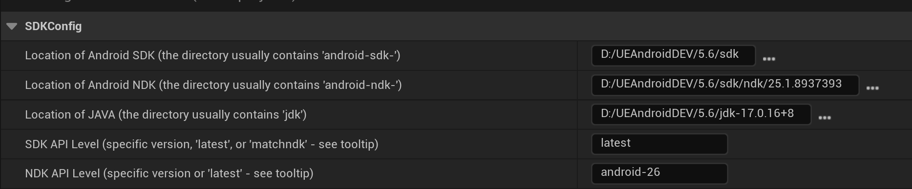
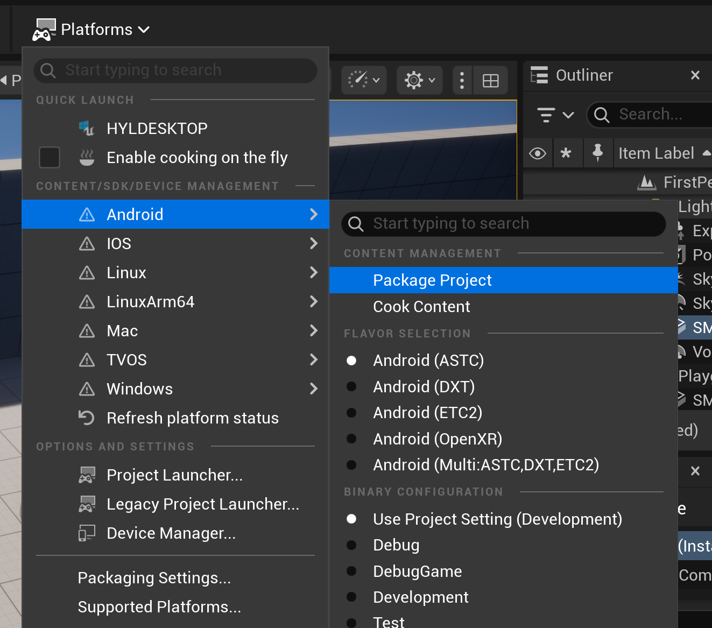

# Unreal Tips: Packaging Android Without Android Studio

Developing Unreal Engine projects for Android often means following official documentation that requires installing Android Studio and matching versions of the SDK, NDK, and JDK. This process can be inconvenient, when work with multiple Unreal Engines, since different engine versions may need different Android toolchains. This guide shows how to set up a standalone Android environment UnrealEngine without Android Studio.

## Prerequisites

For example, targeting Unreal Engine 5.6:

1. **Download and Extract the Following:**
    - **Android Command Line Tools:**  
      [Download](https://developer.android.google.cn/studio)  
      Contains scripts to manage SDK packages.
    - **Platform Tools:**  
      [Download](https://developer.android.com/tools/releases/platform-tools)  
      Includes `adb.exe` for device communication.
    - **OpenJDK 17:**  
      [Microsoft JDK 17.0.16 (Windows x64)](https://aka.ms/download-jdk/microsoft-jdk-17.0.16-windows-x64.zip)  
      Required for Java-based build tools.

    Place all extracted folders in a dedicated directory, e.g. `D:\UEAndroidDEV\5.6`.

    ```
    D:\UEAndroidDEV\5.6\
    ├── cmdline-tools
    ├── jdk-17.0.16+8
    ├── platform-tools
    ```

## Environment Setup

Set the `JAVA_HOME` environment variable so Unreal Engine can find your JDK:

```powershell
$env:JAVA_HOME = "D:\UEAndroidDEV\5.6\jdk-17.0.16+8"
echo $env:JAVA_HOME
```

## Installing the Android SDK

1. **Create an SDK Directory:**
    ```
    D:\UEAndroidDEV\5.6\sdk
    ```

2. **Install Required Packages:**  
    Use the command line tools to install only the packages Unreal Engine needs. You can find the exact package names in `Engine/Extras/Android/SetupAndroid.bat`.

    ```powershell
    ./sdkmanager.bat "platform-tools" "platforms;android-34" "build-tools;34.0.0" "cmake;3.22.1" "ndk;25.1.8937393" --sdk_root="D:\UEAndroidDEV\5.6\sdk"
    ```

3. **Verify Installation:**  
    Your SDK directory should contain subfolders like `build-tools`, `cmake`, `ndk`, `platform-tools`, and `platforms`.

## Faking Android Studio (Optional)

Unreal Engine checks for Android Studio by default. To bypass this check, create an empty file named `studio64.exe` in `C:/Program Files/Android/Android Studio/bin`:

```powershell
New-Item "C:\Program Files\Android\Android Studio\bin\studio64.exe" -ItemType File
```

## Unreal Engine Project Settings

1. **Set SDK, NDK, and JDK Paths:**  
    In your Unreal project, navigate to **Edit > Project Settings > Platforms > Android SDK**. Specify the paths to your local SDK, NDK, and JDK installations.

    

2. **Switch Engine:**  
    After setting these paths, Unreal Engine updates the `UserEngine.ini` file located at `XXX\AppData\Local\Unreal Engine\Engine\Config\UserEngine.ini`:

    ```ini
    [/Script/AndroidPlatformEditor.AndroidSDKSettings]
    SDKPath=(Path="XXX")
    NDKPath=(Path="XXX")
    JavaPath=(Path="XXX")
    SDKAPILevel=XXX
    NDKAPILevel=XXX
    ```

    If you work with multiple Unreal Engine versions, also check these values in `UserEngine.ini` before packaging your project.

2. **Build and Package:**  
    You can now package your project for Android without needing Android Studio installed.

    

I have already tested this method on a prebuilt/source engine of UE 5.6.1,prebuilt/source engine of ue4.27, try it out if you are interested.

> BTW, Android Studio is still necessary if you want to profile your app, you can download a portable version instead of a installer.
