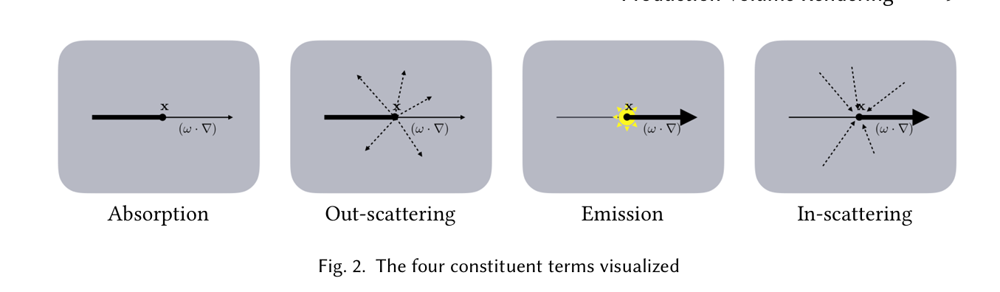
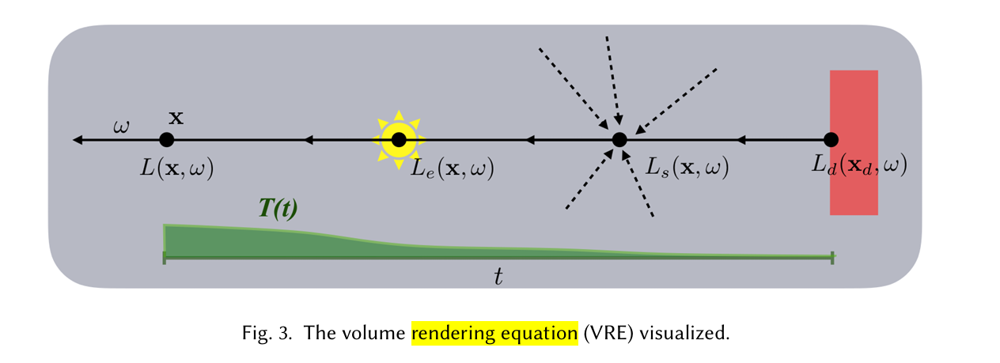

## Volume Rendering Theory

There are four main process when light propagate in volume.

- absorption
- out-scatering, light is scattered away from direction.
- in-scattering, light is scattered into direction
- emission, radiance that is added to the environment from luminous particles
    

We use $x$ is scatteing position, $\omega$ is light direction, $\sigma_s$, $\sigma_t$ as the coeffecient of scattering terms to parameterize the amount of each process, $\sigma_s$ is for in-scattering, $\sigma_t$ for extinction, the extinction is sum up of out scattering and absorption.

$$\sigma_t = \sigma_a + \sigma_{s_{out}}$$

the derivative of the radiance in the direction of $\omega$ is $(\omega\cdot\nabla)$

then the in-scattering part is

$$(\omega\cdot\nabla)L(x,\omega)=\sigma_s(x)\int_{S^2}f_p(x,\omega,\omega^{\prime})L(x,\omega^{\prime})d\omega^{\prime}$$

$$
L_{s} ( {\bf x}, \omega)=\int_{S^{2}} f_{p} ( {\bf x}, \omega, \omega^{\prime} ) L ( {\bf x}, \omega^{\prime} ) d \omega^{\prime}. 
$$

The phase function $f_p(x,\omega,\omega^{\prime})$ is the angular distribution of radiance scattered and
 is usually modeled as a 1D function of the angle $\theta$ between the two directions $\omega$ and $\omega^\prime$. Phase functions
 need to be normalized over the sphere:

the extinction part is

$$(\omega\cdot\nabla)L(x,\omega)=-\sigma_tL(x, \omega)$$

the emmision part is

$$(\omega\cdot\nabla)L(x,\omega)=\sigma_aL_e(x, \omega)$$

$L_e$ is a different lightfield from $L$, and emission as as the countrary process of absorption, we use $\sigma_a$ for its coefficient.

volume rendering equation

$$L(x,\omega)=\int_{t=0}^dT_{t}\left[\sigma_a(x_t)L_e(x_t,\omega)+\sigma_s(x_t)L_s(x_t,\omega)+L_d(x_d,\omega)\right]dt$$

$$T_{t} = \exp\left(-\int_{s=0}^t\sigma_t(x_s)ds\right)$$

$T_{t}$ is thetransmittance from the origin $x$ of the ray to the position $x_t = x-t\omega$ on the ray parametrized
 by $t$. The transmittance is the reduction factor from absorption and out-scattering between $x$
 and $x_t$.

## Phase Function

We recognise two types of elastic light scattering rel
evant for computer graphics — Rayleigh scattering and
 Mie scattering, depend on their physical basis.

### Rayleigh Scattering

Rayleigh scattering occurs on particles that conform to the following criterion:

$$d<\frac{\lambda}{2\pi}$$

oxygen, nitrogen or carbon dioxide molecules.

$$f_{p}(\theta)=\frac{3}{4}(1+\cos^{2}(\theta)).$$

### Mie Scattering

Mie Scattering always used to describe larger particles, its scattering is more complex, and contains forward and backwards lobe.

Cornette-Shanks function

$$
f_p{} ( \theta)=\frac{3 ( 1-g^{2} )} {2 ( 2+g^{2} )} \frac{( 1+\operatorname{c o s}^{2} ( \theta) )} {( 1+g^{2}-2 g \operatorname{c o s} ( \theta) )^{3 / 2}} \tag{3} 
$$

there are other math approximations of to fit the distribution of Mie Scattering, See [Appendix](##Appendix)

## Appendix

Henyey-Greenstein function

$$
f_{p} ( \theta)=\frac{1} {4 \pi} \frac{1-g^{2}} {( 1+g^{2}-2 g \operatorname{c o s} \theta)^{\frac{3} {2}}} 
$$

https://cornercodes.com/2020/11/04/mie-phase-functions-comparison/
https://research.nvidia.com/labs/rtr/approximate-mie/publications/approximate-mie.pdf
