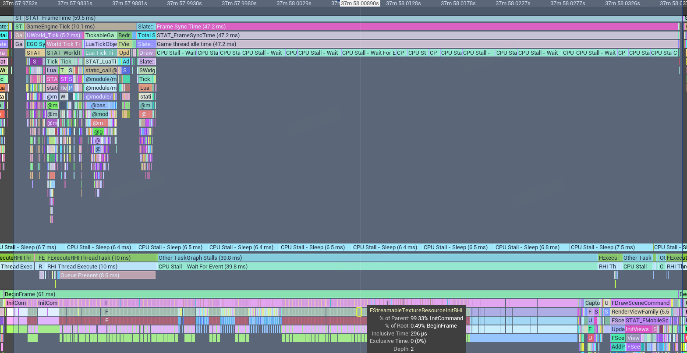
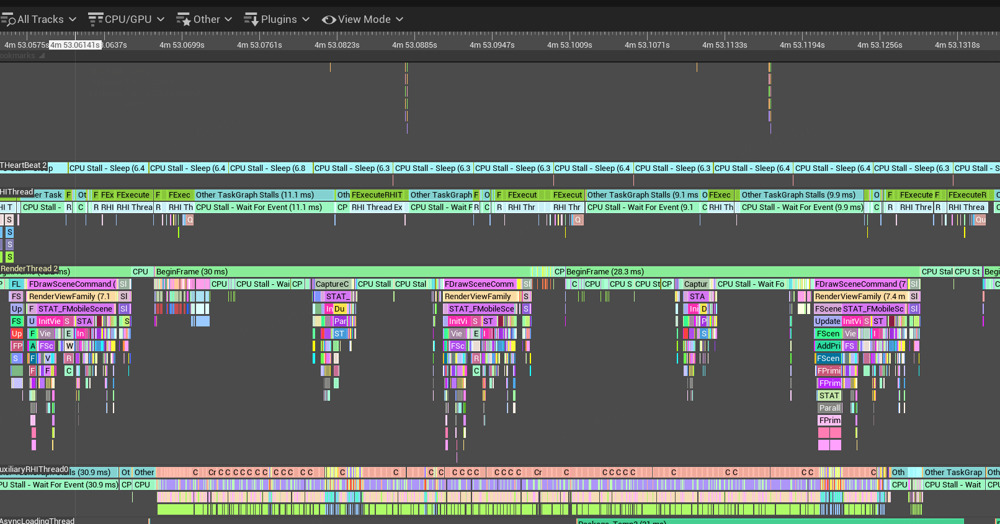

# Unreal Optimization: Asynchronous Resource Initialization with Auxiliary Render Thread

## Problem Overview

In UE mobile development, the rendering resource initialization process after resource loading often becomes a performance bottleneck. Although resource loading is asynchronous to the Game thread, after loading completes, the Game thread sends a large number of resource initialization commands to the Render thread. When Texture/Buffer creation accumulates on the Render/RHI threads, it indirectly blocks the Game thread (UE's multi-threading mechanism requires the Render thread to be at most 1 frame behind the Game thread).

Our project has tried several optimization approaches, such as preventing GLES buffer creation from blocking the RHI thread, creating Texture2DArray without flush and locking/unlocking all slices at once, and disabling SubmitOnTextureUnlock on the Vulkan platform. These measures can alleviate stuttering in certain scenarios. However, as map complexity increases, similar issues persist.

The following image shows a typical call stack causing Game thread stuttering due to this issue:



## Optimization Approach

### Render Thread Modifications

By analyzing the function call stack, we can see that stuttering is primarily caused by the render thread executing large amounts of FRenderResource::InitRHI. In our project, this mainly includes the following resource types:

- StaticMeshVeretxBuffer
- RawIndexBuffer
- PositionVertexBuffer
- ColorVertexBuffer
- InstancedStaticMeshVertexBuffer
- Texture2DResource
- Texture2DArrayResource

We introduce new AuxiliaryRHI threads that, similar to the render thread, receive tasks via `ENQUEUE_AUXILIARY_RHI_RESOURCE_COMMAND`. If multiple auxiliary threads are enabled, we use `ENQUEUE_AUXILIARY_RHI_RESOURCE_COMMAND_ROUND_ROBIN` to distribute creation tasks across different auxiliary threads in a round-robin fashion.

```cpp
void FColorVertexBuffer::InitRHI_AuxiliaryThread()
{
    // Create thread-safe handle to query if the command has completed
    AuxiliaryRHIStatusHandle = CreateThreadSafeHandle();
    
    ENQUEUE_AUXILIARY_RHI_RESOURCE_COMMAND_ROUND_ROBIN(ColorVertexBuffer_CreateRHIBuffer_AuxiliaryThread)
    ([this](int MyContextIndex)
    {
        RHIBeginResourceCommands_AuxiliaryThread(AuxiliaryRHIStatusHandle, MyContextIndex);
        QUICK_SCOPE_CYCLE_COUNTER(FColorVertexBufferInitRHI_AuxiliaryThread);
        
        RHICreateVertexBuffer_AuxiliaryThread(SizeInBytes, Usage, State, CreateInfo, ContextIndex);
        ColorComponentsSRV = RHICreateShaderResourceView_AuxiliaryThread(
            FShaderResourceViewInitializer(VertexData ? VertexBufferRHI : nullptr, PF_R8G8B8A8), 
            MyContextIndex
        );
        
        RHIEndResourceCommands_AuxiliaryThread(MyContextIndex);
    });
}
```

### RHI Thread Modifications

At the RHI layer, we need to implement corresponding resource creation interfaces:

- RHICreateXXX_AuxiliaryTherad
- RHILockXXX_AuxiliaryThread
- RHIUnLockXXX_AuxiliaryThread

For Vulkan/Metal, CommandBuffer needs to be maintained separately across different threads. We also need to create corresponding CommandContext for the AuxilairyRHI thread, using the ContextIndex calculated by `ENQUEUE_AUXILIARY_RHI_RESOURCE_COMMAND_XXX` to get the Commandbuffer for the appropriate thread.

Additionally, we need to add:

- RHIBeginFrame_AuxiliaryThread/RHIEndFrame_AuxiliaryThread (for cleaning up data and memory in the auxiliary thread)
- RHISubmitContextCommands_AuxiliaryThread (for submitting GPU commands and waiting for the GPU)

### Resource Dependency Issues

We handle dependency issues by modifying the AsyncLoading module:

1.  FRenderResource::InitRHI is called by BeginInitResource in Object::PostLoad - we skip this step initially
2.  In TickAsyncLoading, we check each frame whether resources have completed creation on the AuxilairyThread
3.  After creation completes, we execute PostLoadFinish, update resources, and add them to the scene
4.  AsyncLoading then loads subsequent dependent resources

This approach avoids the missing draw issues from skip-draw methods seen in \[1\], though the downside is increased loading delay. Currently, we only enable this through script control during stages that aren't sensitive to loading speed (such as in-game level streaming). It remains disabled in scenarios with frequent loading, like map transitions or lobbies.

## Result



The initialization that was originally on the render thread has been moved to the Auxiliary thread and no longer blocks the execution of the Game thread.

## References

\[1\] [UOD2021 "Dawn Awakening" Mobile Real-time GI and Multi-threaded Rendering Optimization | Photon Studio, Wei Zhixiao](https://www.bilibili.com/video/av978281593/)