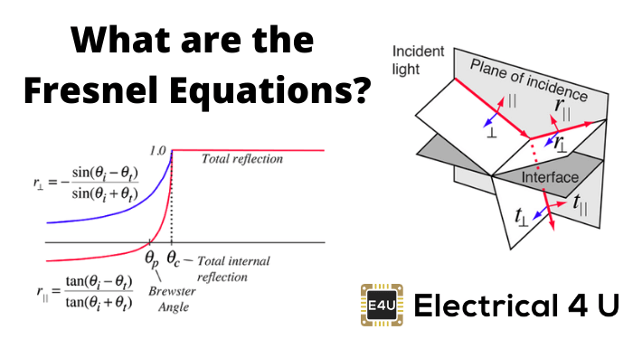
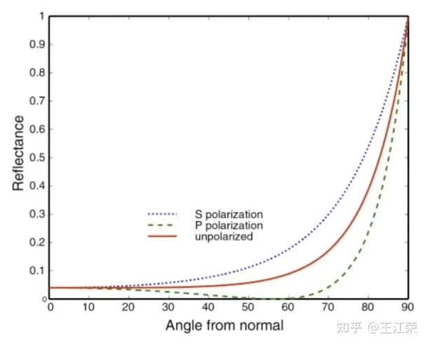
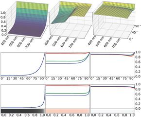
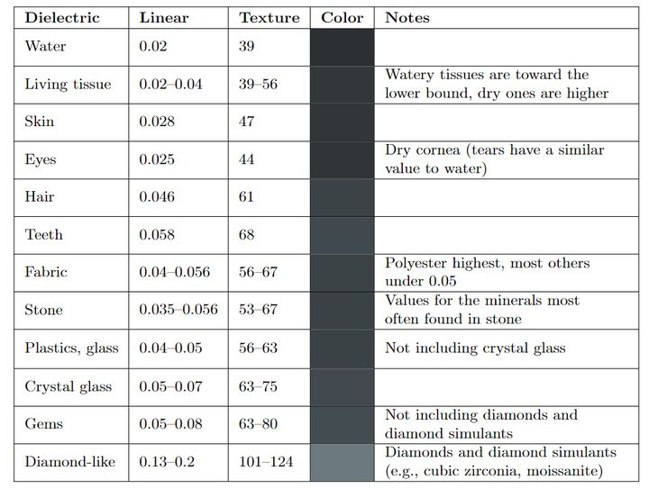
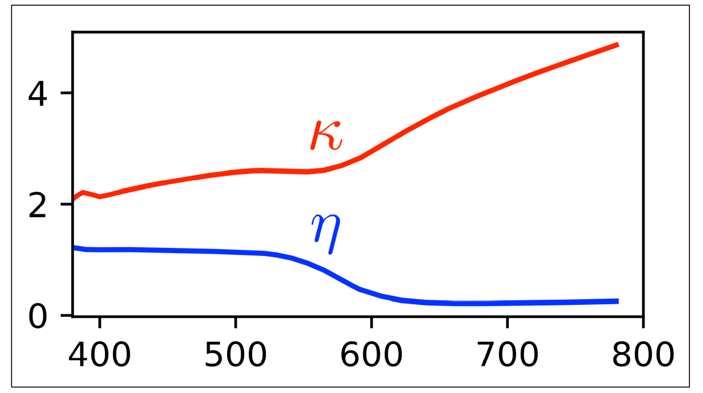
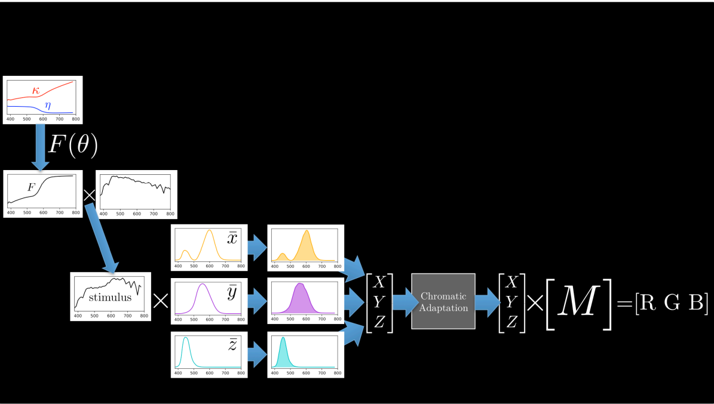

# Fresnel

what is fresnel equation, and how it applies to real-time rendering

## Fresnel Equation

The Fresnel equations describe the interaction of light with a planar interface between two substances. They assume no surface variations larger than 1-100 light wavelengths.

Light incident on a flat surface split into reflected part and refrated part, we define the angle between surface normal and reflected light direction is $\theta_i$, the angle between surface normal and refracted light direction is $\theta_t$, the Index of Refraction(IOR) of two substance is $n_{i}$, $n_{t}$
(incident, transmitted).

> the formula of IOR is  $n = \eta + ik$, for dieletric, kappa is zero, we use 

(light is an electromagnetic wave, and the electric field of this wave oscillates perpendicularly to the direction of propagation)

S polarization is pependicular to the plance of incidence
P polarization is parallel to the plance of incidence

We don't derive the Fresnal Equation but just give it out. you can find the derivation [here](https://www.brown.edu/research/labs/mittleman/sites/brown.edu.research.labs.mittleman/files/uploads/lecture13_0.pdf)

the reflection and refraction coefficient of S polarization and P polarization

$R_s = (\frac{n_i\cos\theta_i-n_t\cos\theta_t}{n_i\cos\theta_i+n_t\cos\theta_t})^2$  $T_s = (\frac{2n_i\cos\theta_i}{n_i\cos\theta_i+n_t\cos\theta_t})^2$

$R_p = (\frac{n_i\cos\theta_t-n_t\cos\theta_i}{n_i\cos\theta_t+n_t\cos\theta_i})^2$ $T_p = (\frac{2n_i\cos\theta_i}{n_i\cos\theta_t+n_t\cos\theta_i})^2$

for both polarizations, $n_{i} \sin\theta_i = n_{t} \sin\theta_t$ , so we can replace $\cos\theta_t$ with $\sqrt{1-\frac{n_i}{n_t}(\sin\theta_i)^2}$ and get the equation only about $\theta_i$

in real-time rendering, we consider no polarization of S and P, so the reflection is $\frac{R_s+R_p}{2}$, and in this blog we don't care about refraction, $T_s$, $T_p$ are ignored.

the following figure demonstrate the reflection ratio of light shoot to different material from air.(glass copper aluminum)

#### total internal reflection

if the Index of Refraction of substance $n_i<n_t$, according to snell's law, $\theta_t>\theta_i$, if $\sin\theta_i = \sin\theta_c=\frac{n_t}{n_i}$, no transmission occurs, that is total internal reflection.  

## Approximating Fresnel In Real-Time

####  Shilick Approximation

Computing the Fresnel equations is expensive for real-time rendering. The Schlick approximation interpolates between F0 at normal incidence and 1 at grazing angles:

the fresnel reflection can be see as an interpolation between $F_0$ and $1$, $F_0$ is the fresnel reflection when $\theta_i = 0$. 

$F_0 =\frac{R_s+R_p}{2}=(\frac{n_i-n_t}{n_i+n_t})^2$

the F0 value of some dialetric materials

$F_0$ requires Index of Refraction which is not easy to understand, in rtr, we just use an RGB color instead.

here we got the entire schlick approximation:

$F_r \approx F_0 + (1-F_0)(1-\cos\theta_i)^5$

here is an figure of result of schlick approx compared with fresnel IOR(glass, copper, aluminum, chromium, iron, zinc). The reflection of dialetric material like glass can be approxed correctly, but for metal, it's not good enough.

the reflection of metal varies with the wavelenth of light, lets recall the IOR, the IOR of metal(especially colored metal) varies from with light wavelength.

that means for RGB light, the reflection is different, we just assign RGB with different  $F_0$ to solve this.

from the figure, at grazing angle, the reflection have a small decrease for some metals(aluminum, chromium, iron, zinc). An easy way is to modify the approx to 

$F_r \approx F_0+(F_{90}-F_0)(1-\cos\theta_i)^{\frac{1}{p}}$ 

## What's more

[Lazányi05](https://www.researchgate.net/publication/221546550_Fresnel_Term_Approximations_for_Metals) added an error term in original schlick approx, but both $a$ and $\alpha$ are not artist friendly.

$F_r \approx F_0+(1-F_0)(1-cos\theta_i)^5 - a\cos\theta_i(1-\cos\theta_i)^{\alpha}$

[Gulbrandsen14](https://jcgt.org/published/0003/04/03/) gaves an artist friendly approxmiztion for metallic fresnel. He made an remap of IOR to reflectivity $r$ and edgetint $g$ RGB colors derived from Fresnal Equation.

[Hoffman19](http://renderwonk.com/publications/mam2019/)

according to hoffman, from $\eta, \kappa$ in fresnel equations, to final RGB color, have to go through a full trip below(see original slides for detail), if you derive a RGB color from $\eta$ and $\kappa$ at RGB wavelength light, and use it directly as RGB color after fresnel equations applied, it's not physically correct. 

he concluded that in many scenes, use schlick approx may be the best choice, he also preset a model for additional accuracy on edge control.

$F_r \approx F_0+(1-F_0)(1-\cos\theta_i)^5 - a\cos\theta_i(1-\cos\theta_i)^{\alpha}$

- chose $\alpha = 6$ for better fitting the Schlick delte-E errors.
- $a = \frac{F_0+(1-F_0)(1-\cos\theta_{max})^5 - h}{\cos\theta_{max}(1-\cos\theta_{max})}$
$h = F(\theta_{max}), \theta_{max} = \arccos(\frac{1}{7}) \approx 81.7$

the final formula is

$F_r \approx F_0+(1-F_0)(1-\cos\theta_i)^5 - a\cos\theta_i(1-\cos\theta_i)^{6}$

compared with schlick's one, it can yield smaller error with GT.

## Furthur Reading

[Hoffman20](https://blog.selfshadow.com/publications/s2020-shading-course/hoffman/s2020_pbs_hoffman_slides.pdf)

[Belcour20](https://blog.selfshadow.com/publications/s2020-shading-course/belcour/slides/index.html)

## Other thoughts

**why almost all render engine use a fresnel term to mix specular and diffuse color?**

> the fresnel equation describes the light amount of reflection and refraction. The reflected light contributes to the specular brdf, and the refracted light under the surface will be absorbed and scatterd outside the surface. the scattered light is the diffuse part we calculated in shader.

> update on 9.11 2023, I think it is a simple mix between diffuse and microfacet model now, because diffuse and microfacet is two different model of the surface, diffuse is not subsurface scattering.

# Ref

- https://jcgt.org/published/0003/04/03/
- https://zhuanlan.zhihu.com/p/158025828
- https://learnopengl.com/PBR/Theory
- https://hal.inria.fr/hal-02883680v2/document
- https://blog.selfshadow.com/publications/s2020-shading-course/hoffman/s2020_pbs_hoffman_slides.pdf
- https://www.brown.edu/research/labs/mittleman/sites/brown.edeu.research.labs.mittleman/files/uploads/lecture13_0.pdf
- https://www.electrical4u.com/fresnel-equations/
- https://zhuanlan.zhihu.com/p/31534769