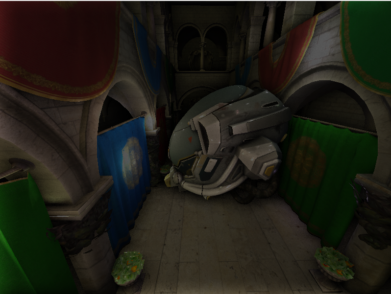

# Dredgen-gl渲染器构建记录

### SSAO

放在了deferred lighting pass和post process pass之间

在shader中生成一些采样点，用一个ssao_factor控制采样的范围，采样gbuffer中的的深度通道和当前像素的depth比较，计算一个visibility，再和color texture相乘

效果

ssao 

在helmet周围有一圈阴影:(

# FXAA

计算周围4个像素的亮度，计算出一个对比度，根据threshold判断是否为边缘，再进行blend

# Deferred Skybox

forward shading中的skybox是按照learnopengl做的，转成deferred后搞
了好久都没做出来，这次终于可以了，是在deferred lighting后加了一个pass，之后应该会改到geopass后

关键步骤

1. 在gbuffer 的geopass中，将ndc空间的z值保存到normal texture的alpha通道

2. skyboxpass中关掉depthtest，传入normaltex，colortex，skybox，深度==1.0的像素即没有被遮挡的像素渲染skybox

ps代码如下
~~~
#version 460 core
in vec3 TexCoords;
out vec4 FragColor;

uniform samplerCube skybox;
uniform sampler2D normal_tex;
uniform sampler2D color_tex;
uniform int WIDTH, HEIGHT;
void main() {

  vec2 uv = vec2(float(gl_FragCoord.x) / float(WIDTH),
                 float(gl_FragCoord.y) / float(HEIGHT));
  float depth = texture(normal_tex, uv).a;

  if (depth == 1.0) {
    FragColor = texture(skybox, TexCoords);
  } else {
    FragColor = texture(color_tex, uv);
  }
}
~~~