# Cascade Shadow Maps/Parallel-Split Shadow Maps
在games202中，闫老师介绍了shadowmap，以及用pcf以及pcss做软阴影

shadowmap
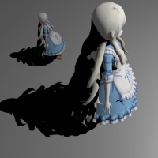
pcf
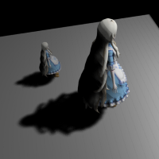
pcss
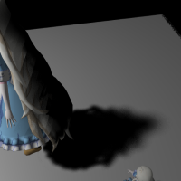

**shadowmap中的一些问题**

- Perspective Aliasing

距离light远的物体投射出的阴影精度低

- Projective Aliasing

物体表面和light方向几乎平行，shadowmap中深度信息不准确造成的

- Shadow Acne and Erroneous Self-Shadowing

自遮挡，查询shadowmap时

- Peter Panning

bias设置太大产生的看起来像人体浮在空中的问题

**CSM**

在游戏引擎中，更常用的技术是cascaded shadow maps，Nvidia这篇论文中介绍了csm的算法

原文地址：https://developer.download.nvidia.com/SDK/10.5/opengl/src/cascaded_shadow_maps/doc/cascaded_shadow_maps.pdf

*图1*

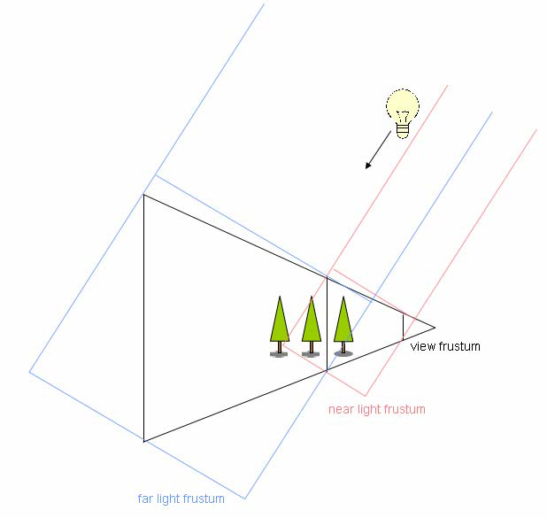

仅用一张shadowmap记录所有深度信息会有精确度的问题，距离较近的物体没问题，而距离远的物体在shadowmap上占像素很少，CSM为了解决这个问题，把光源空间的视锥体light frustum，分成多个小的视锥体，每个视锥体都计算一个shadowmap

**算法流程如下：**

- For every light’s frustum, render the scene depth from the lights point of view. 
- Render the scene from the camera’s point of view. Depending on the 
fragment’s z-value, pick an appropriate shadow map to the lookup into. 

**Details** 

建议用一个texture array存储shadowmaps

**View Frustum Split**

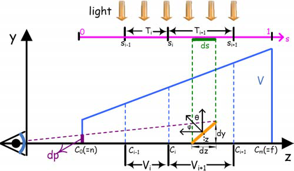

计算eye space下split后的frustum的z值，ds是一个像素在shadowmap上的长度，阴影长度为dp

得出下面等式：

$\frac{dp}{dy}=\frac{n}{z}$

$\frac{dz}{\cos\theta}=\frac{dy}{\cos\phi}$

$\frac{dp}{dz}=\frac{n\cos\phi}{z\cos\theta}$

$\frac{dp}{ds}=\frac{dz\ n\cos\phi}{ds\ z\cos\theta}$

论文[1]中作者测试了不同split方法，包括logarithmic split scheme, uniform split scheme and practical split scheme

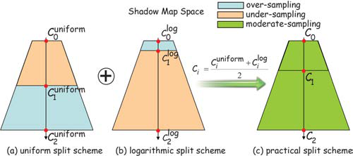

- logarithmic split scheme

若shadowmap上不同位置的aliasing程度相同，那$\frac{dp}{ds}$应为常数，$\rho=\frac{dz}{z\ ds}$是不变的

假设所有的frustum完全覆盖了depth range

可得

$s=\int_0^s\ ds=\frac{1}{rho}\int_n^z\frac{dz}{z}=\frac{1}{\rho}\ln(\frac{z}{n})\ s \in [0,1]$

$\rho=\ln(\frac{f}{n})$

在depth范围内积分 

$s=\frac{\ln(z/n)}{\ln(f/n)}$

在这种情况下，理想的perspective shadowmap满足

$s=\frac{z/n}{ln(f/n)}$

perspective projection中，$s = A/z+B$是非线性变换，logarithmic split的方法目的是让perspective alising error更平滑，要用这个式子去拟合上面的log式

令$s_i(z)=C_i^{log}$

$s_i=\frac{\ln(C_i^{log}/n)}{\ln(f/n)}$

$C_i^{log}=n(\frac{f}{n})^{s_i}$

第i个分割点的位置就能计算了

$C_i^{log}=n(\frac{f}{n})^{i/m}$

结果如图(b)

这种split方法在距离相机很近的情况下light frustum很小，包括的物体较少

- Uniform Split Scheme

就是平均分，这样的效果最差，距离越远走样越严重

- Practical Split Scheme

把log和uniform的结果平均了一下，效果还不错

**Light frustum Split**

这一步将light frustum$W$分为更小的light frustum $W_i$

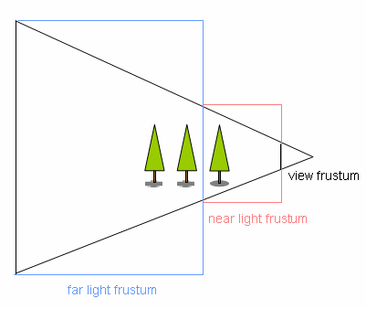

上图用2个frustum渲染阴影时，在light frustum里，view frustum外的部分没有被利用到，shadowmap中有一部分浪费了

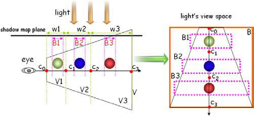

论文[1]中计算出$W_i$和对应view frustum中$V_i$相交部分的boundingbox，根据这个boundingbox设置light frustum

Nvidia给出了用一个线性变换修正的方法

$z_i=\lambda n(f/n)^{i/N}+(1-\lambda)(n+(i/N)(f-n))$

$\lambda$调整修正的程度

**Final scene rendering**

在ps阶段，每个像素的深度值（projection后的）和不同shadowmap的z-range比较，找到对应的第ith级shadowmap，再转换到worldspace并乘上对应的light mat到光源空间，变换为0-1的texcoord，就可以查shadowmap上的值计算阴影了

**对比**

用4 split csm渲染的结果

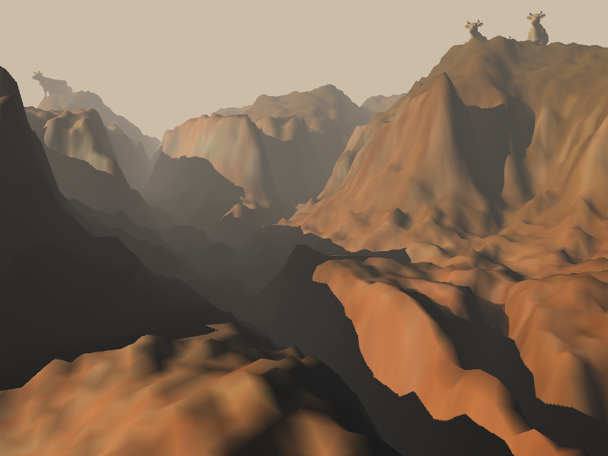

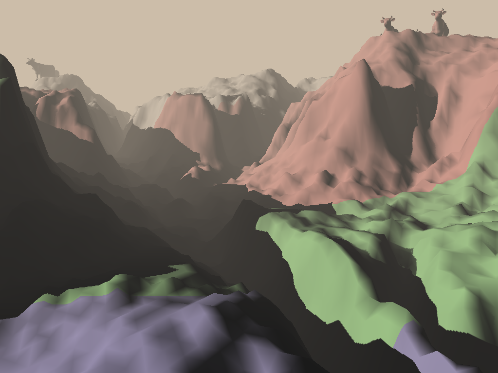

1 split

3 split，效果比1 split好很多

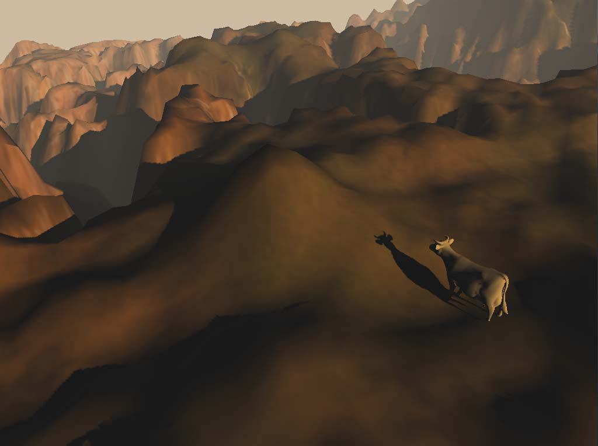

## 参考

[1]Parallel-split shadow maps for large-scale virtual environments
[2]https://docs.microsoft.com/en-us/windows/win32/dxtecharts/common-techniques-to-improve-shadow-depth-maps#:~:text=The%20distended%20shadows%20highlighted%20in%20Figure%207%20demonstrate,the%20geometry%20with%20respect%20to%20the%20light%20camera.