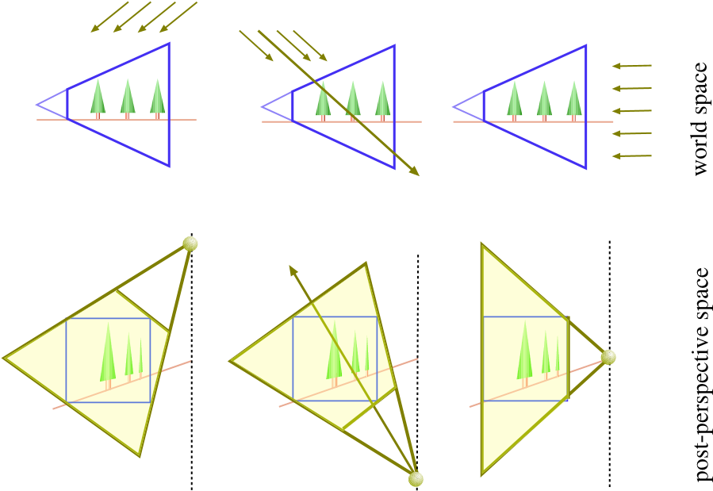

# Perspective Shadow Map

原文地址[gdc2004_perspectiveshadowmap](http://download.nvidia.com/developer/presentations/GDC_2004/gdc2004_perspectiveshadowmap.pdf)

普通shadowmap从light space均匀采样，在view space上是不均匀的，如何把light space转换到view space中来就是psm的工作

**Post-Projective Space**

即NDC空间，[-1,-1,-1]..[1,1,1]（OpenGL）

将light也转换到ndc空间中，directlight变成 从infinite plance发射的pointlight

在这个空间中渲染一张shadowmap，shadowmap包含的信息就是一个cube了，由于shadowmap包含的信息是perspective projection后的，perspective aliasing会大大减少

----未完---

## 参考

[1]Perspective Shadowmap - GDC2004 Nvidia
[2]Perspective Shadow Maps
