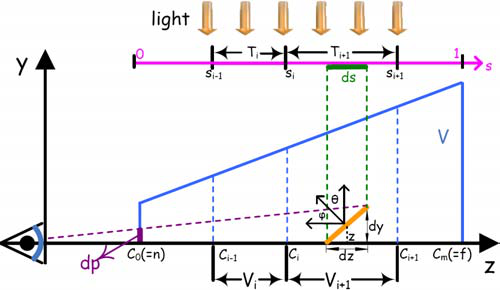
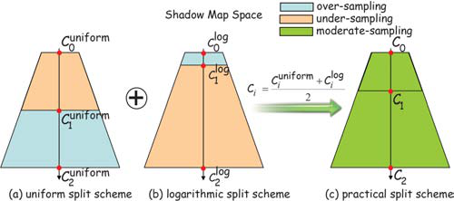
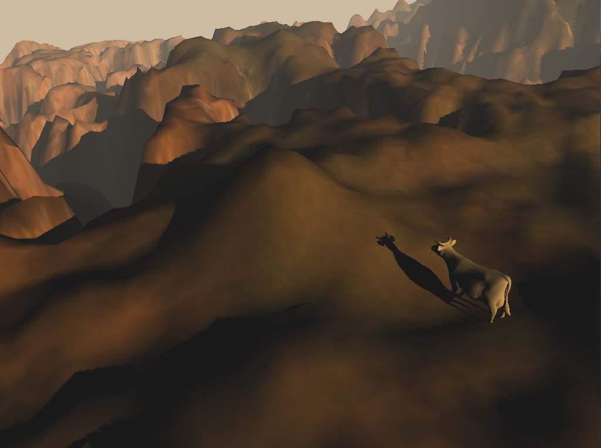

# Cascade Shadow Maps
在games202中，闫老师介绍了shadowmap，以及用pcf以及pcss做软阴影

shadowmap

pcf

pcss

在游戏引擎中，更常用的技术是cascaded shadow maps，Nvidia放出的这篇论文中较为详细地介绍了csm的算法

原文地址：https://developer.download.nvidia.com/SDK/10.5/opengl/src/cascaded_shadow_maps/doc/cascaded_shadow_maps.pdf

*图1*

仅用一张shadowmap记录所有深度信息会有精确度的问题，距离较近的物体没问题，而距离远的物体在shadowmap上占像素很少，CSM为了解决这个问题，把光源空间的视锥体light frustum，分成多个小的视锥体，每个视锥体都计算一个shadowmap

**算法流程如下：**

- For every light’s frustum, render the scene depth from the lights point of view. 
- Render the scene from the camera’s point of view. Depending on the 
fragment’s z-value, pick an appropriate shadow map to the lookup into. 

(如果分成多个frustum，两个相邻的frustum之间阴影会有缝隙)
**Detailed：** 
建议用一个texture array存储shadowmaps

**Shadow-map generation**

计算eye space下split后的frustum的z值，ds是一个像素shadowmap边长，产生的阴影长度为dp

可得
$\frac{dp}{dy}=\frac{n}{z}$
$\frac{dz}{\cos\theta}=\frac{dy}{\cos\phi}$
$\frac{dp}{dz}=\frac{n\cos\phi}{z\cos\theta}$
$\frac{dp}{ds}=\frac{dz\ n\cos\phi}{ds\ z\cos\theta}$

论文[1]中讨论了不同的split方法，有logarithmic split scheme, uniform split scheme and practical split scheme

**logarithmic splitscheme**

理论上，如果最后计算出的shadow的error相同，$\frac{dp}{ds}$应为常数，那么cos项的系数也应该是常数，即
$\frac{dz}{zds}=\rho$
在depth范围内积分 
$s=\int_0^s ds=\frac{1}{\rho}\int_n^z \frac{dz}{z}=\frac{1}{\rho}\ln(\frac{z}{n})\ s\in [0,1]$

得到

$\rho=\ln(f/n$)

那么

$s=\frac{\ln(z/n)}{\ln(f/n)}$

split point应呈指数分布
$z_i=n(f/n)^{1/N}$
N是split的次数
**Final scene rendering**

在ps阶段，每个像素的深度值（projection后的）和不同shadowmap的z-range比较，找到对应的第ith级shadowmap，再转换到worldspace并乘上对应的light mat到光源空间，变换为0-1的texcoord，就可以查shadowmap上的值计算阴影了

**对比**

用4 split csm渲染的结果

1 split

3 split，效果比1 split好很多

### 参考

[1]Parallel-split shadow maps for large-scale virtual environments
